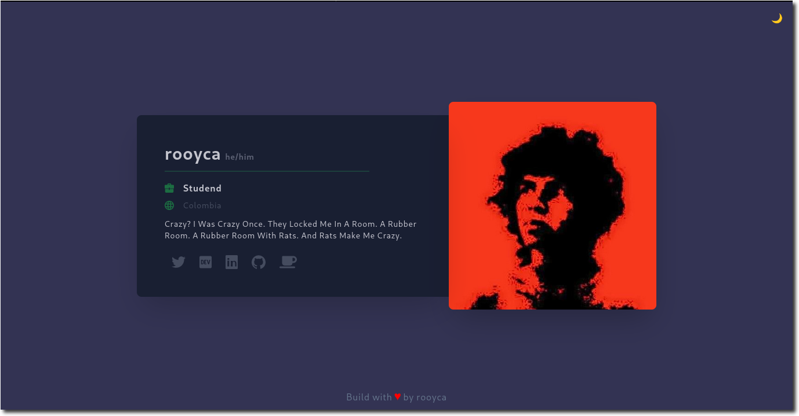

# 🌳 GHTree

Web app similar to LinkTree using information from GitHub.  



## 🧪 Try it out

> It may take a few seconds to load the first time.

### https://ghtree.onrender.com/v2/rooyca

## 🌟 Don't hesitate to open a pull request with [your own profile](app/data/rooyca.md). 🌟

## 🚀 Deploy

You can run your own instance locally or deploy it to a serverless platform like [Fly.io](https://fly.io/) or [Render](https://render.com/).

### -> Locally

There are two ways to run the app locally, using Docker or Python.

#### 🐳 Docker (recommended)

```sh
docker run --rm -p 8000:8000 ghcr.io/rooyca/ghtree:master
```

You could also build the image yourself.

```sh
docker build -t ghtree .
docker run --rm -p 8000:8000 ghtree
```

There are three Dockerfiles, one with full `python` image, one with `python:slim` and one with `python:alpine`. You can use the one that suits you best. For example, if you want to use the `slim` version, you can do:

```sh
docker build -t ghtree -f Dockerfile.slim .
docker run --rm -p 8000:8000 ghtree
```

Although I recommend using the [alpine version](Dockerfile), since it is the smallest one. Let's look at the size of each image.

| Dockerfile | Size |
| --- | --- |
| [Dockerfile (alpine)](Dockerfile) | 167 MB |
| [Dockerfile.slim](Dockerfile.slim) | 562 MB |
| [Dockerfile.full](Dockerfile.full) | +1 GB |


#### 🐍 Python

```sh
pip install -r requirements.txt
python -m uvicorn app.main:app --reload
```

### -> Serverless

You can deploy the app to any serverless platform that supports Python apps, like [Fly](https://fly.io/), [Render](https://render.com/) or any other.

#### 🦋 Fly.io

```sh
fly launch
fly deploy
```

#### 🚀 Render

Run it with Docker. Use the following image:

```sh
ghcr.io/rooyca/ghtree:master
```

That's it! 🎉

## 🛠️ Build with

- [FastAPI](https://fastapi.tiangolo.com/)
- [TailwindCSS](https://tailwindcss.com/)
- [HTMX](https://htmx.org/)
- [GitHub API](https://docs.github.com/en/rest)
- [Font Awesome](https://fontawesome.com/)

## 📝 TODO

- [ ] Add nix support

## 📄 License

[MIT](LICENSE)